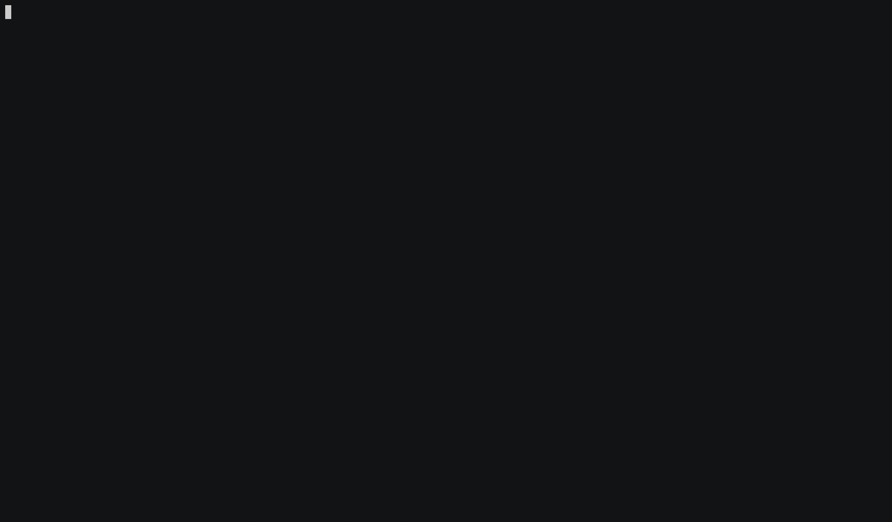

# AWSweeper

AWSweeper is based on the cloud-agnostic Terraform API for deletion that wipes out all (or parts) of the resources in your AWS account. Resources to be deleted can be filtered by their ID, tags or
creation date using [regular expressions](https://golang.org/pkg/regexp/syntax/) declared in a yaml file (see [all.yml](./example/all.yml)).

Happy erasing!

[](https://asciinema.org/a/149097)

## Usage

- Authenticate your SAML Identity Provider

  More details: https://gitlab.com/tw-toc/saml-aws-functions

- Setup awsweeper latest version v0.9.0:

  ```bash
  # install it into ./bin/
  sh ./install.sh v0.9.0
  ```

- Run the CMD awsweeper

  ```bash
  ./bin/awsweeper [options] <config.yml>
  ```

  For example:
  ```bash
  $ ./bin/awsweeper --region ap-southeast-1 --dry-run example/aws_vpc.yml
   • downloaded and installed provider                  name=aws version=2.43.0
   • configured provider                                name=aws version=2.43.0
   • using region: ap-southeast-1
   • SHOWING RESOURCES THAT WOULD BE DELETED (DRY RUN)

	---
	Type: aws_vpc
	Found: 1

		Id:		vpc-2afc2e4f
		Tags:		[Name: default]

	---

   • TOTAL NUMBER OF RESOURCES THAT WOULD BE DELETED: 1
  ```
  
  To see options available run `./bin/awsweeper --help`.
  
  **Please make sure to add `--dry-run` in each execution for the rehearsal before sweeping any resources**

- Deploy `awsweeper` via AWS Lambda

  To houseclean any irrelevant aws resources in our account, we can simply wrap up `awsweeper` into a python Lambda function, and trigger it periodically as every day at 19:00 UTC `cron(0 19 * * ? *)`, so as to let Lambda take care of every cleanup instead of human hand.

  The deployment will compile and upload all the artefacts into S3 bucket which would be applied by Lambda `awsweeper` CMD execution.

  Please make sure S3 bucket established in each separated regions with naming `<AwsweeperS3Bucket>:<S3BucketRegion>` before Lambda deployment.

  The following is how to deploy Awsweeper Lambda in aws:
  
  - Deploy Lambda IAM role:

    ```bash
    auto/deploy-lambda-role
    ```

  - Package Lambda

    ```bash
    auto/package
    ```

  - Release and deploy Lambda:

    ```bash
    auto/deploy-lambda-in-<ENV>
    ```

    For example: `auto/deploy-lambda-in-Singapore` will deploy awsweeper in Singapore region.


    Here are the detailed params of Lambda in [awsweeper-params.yml](aws/lambda/Singapore/awsweeper-params.yml)

    ```yml
      ---
      AwsweeperS3Bucket: "awsweeper-artefact-bucket"
      S3BucketRegion: "ap-southeast-1"
      LambdaFunctionS3Key: "lambda/awsweeper.zip"
      LambdaFunctionName: "awsweeper"
      LambdaExecutionSchedule: "cron(0 19 * * ? *)"
      VpcId: "vpc-xxxxxxxxxxxxxxxxx"
      SubnetIds: "subnet-xxxxxxxxxxxxxxxxx"
      LambdaMemorySize: "256"
      LambdaRuntime: "python3.8"
      LambdaTimeout: "300"
      LambdaSourceAccount: "494526681395"
      LambdaExecutionRole: "arn:aws:iam::494526681395:role/awsweeper-ExecutionRole-function"
      Owner: "xxx"

    ```

  - Push Lambda in all regions:

    ```bash
    auto/deploy-lambda-in-all
    ```

- Deploy `awsweeper` via AWS ASG+EC2

  To houseclean any irrelevant aws resources with minimal aws resource cost in our account, we can also simply wrap up `awsweeper` into a docker image, use ASG Schedule Action to Launch docker in EC2 at `0 19 * * *` and terminate at `0 21 * * *`, let EC2 spin up each cleanup in regular time instead of human hand.

  - Package and release Docker

    ```bash
    auto/release-docker-image
    ```

  - Deploy ASG+EC2+IAMRole:

    ```bash
    auto/deploy-instance
    ```

## Filter

Resources are deleted via a filter declared in a YAML file.

    aws_instance:
      # instance filter part 1
      - id: ^foo.*
        created:
          before: 2018-10-14
          after: 2018-06-28 12:28:39
            
      # instance filter part 2   
      - tags:
          foo: bar
          NOT(owner): .*
           
    aws_security_groups:

The filter snippet above deletes all EC2 instances that ID matches `^foo.*` and that have been created between
 `2018-06-28 12:28:39` and `2018-10-14` UTC (instance filter part 1); additionally, EC2 instances having a tag 
 `foo: bar` *AND* not a tag key `owner` with any value are deleted (instance filter part 2); last but not least,
 ALL security groups are deleted by this filter.

The general filter syntax is as follows:

    <resource type>:
      - id: <regex to filter by id> | NOT(<regex to filter by id>)
        tagged: bool (optional)
        tags:
          <key> | NOT(key): <regex to filter value> | NOT(<regex to filter value>)
          ...
        created:
          before: <timestamp> (optional)
          after: <timestamp> (optional)
      # OR
      - ...
    <resource type>:
      ...

Here is a more detailed description of the various ways to filter resources:

##### 1) Delete all resources of a particular type

   [Terraform resource type indentifiers](https://www.terraform.io/docs/providers/aws/index.html) are used to delete 
   resources by type. The following filter snippet deletes *ALL* security groups, IAM roles, and EC2 instances:
   
    aws_security_group:
    aws_iam_role:
    aws_instance:
   
   Don't forget the `:` at the end of each line. Use the [all.yml](./example/all.yml), to delete all (currently supported)
   resources.

##### 2) Delete by tags

   If most of your resources have tags, this is probably the best way to filter them
   for deletion. **Be aware**: Not all resources [support tags](#supported-resources) yet and can be filtered this way.
      
   The key and the value part of the tag filter can be negated by a surrounding `NOT(...)`. This allows for removing of 
   all resources not matching some tag key or value. In the example below, all EC2 instances without the `owner: me`
   tag are deleted:

    aws_instance:
      - tags:
          NOT(Owner): me
          
   The flag `tagged: false` deletes all resources that have no tags. Contrary, resources with any tags can be deleted 
   with `tagged: true`:

    aws_instance:
      - tagged: true

##### 3) Delete By ID

   You can narrow down on particular types of resources by filtering on based their IDs.

   To see what the ID of a resource is (could be its name, ARN, a random number),
   run AWSweeper in dry-run mode: `awsweeper --dry-run all.yml`. This way, nothing is deleted but
   all the IDs and tags of your resources are printed. Then, use this information to create the YAML config file.

   The id filter can be negated by surrounding the regex with `NOT(...)`

##### 4) By creation date

   You can select resources by filtering on the date they have been created using an absolute or relative date.

   The supported formats are:
   * Relative
     * Nanosecond: `1ns`
     * Microsecond: `1us`
     * Millisecond: `1ms`
     * Second: `1s`
     * Minute: `1m`
     * Hour: `1h`
     * Day: `1d`
     * Week: `1w`
     * Month: `1M`
     * Year: `1y`
   * Absolute:
     * RCF3339Nano, short dates: `2006-1-2T15:4:5.999999999Z07:00`
     * RFC3339Nano, short date, lower-case "t": `2006-1-2t15:4:5.999999999Z07:00`
     * Space separated, no time zone: `2006-1-2 15:4:5.999999999`
     * Date only: `2006-1-2`

## Dry-run mode

 Use `awsweeper --dry-run <filter.yml>` to only show what
would be deleted. This way, you can fine-tune your YAML filter configuration until it works the way you want it to.

## Supported resources

AWSweeper can currently delete more than 30 AWS resource types.

Note that the resource types in the list below are [Terraform Types](https://www.terraform.io/docs/providers/aws/index.html),
which must be used in the YAML configuration to filter resources.
A technical reason for this is that AWSweeper is build upon the already existing delete routines provided by the [Terraform AWS provider](https://github.com/terraform-providers/terraform-provider-aws).

| Resource Type                    | Delete by tag | Delete by creation date
| :-----------------------------   |:-------------:|:-----------------------:
| aws_ami                          | x             | x
| aws_autoscaling_group            | x             | x
| aws_cloudformation_stack         | x             | x
| aws_cloudtrail             |               |
| aws_cloudwatch_log_group (*new*) |               | x
| aws_ebs_snapshot                 | x             | x
| aws_ebs_volume                   | x             | x
| aws_ecs_cluster (*new*)          | x             |
| aws_efs_file_system              | x             | x
| aws_eip                          | x             |
| aws_elb                          | x             | x
| aws_iam_group                    | x             | x
| aws_iam_instance_profile         |               | x
| aws_iam_policy                   |               | x
| aws_iam_role                     | x             | x
| aws_iam_user                     | x             | x
| aws_instance                     | x             | x
| aws_internet_gateway             | x             |
| aws_key_pair                     | x             |
| aws_kms_alias                    |               |
| aws_kms_key                      |               |
| aws_lambda_function (*new*)      |               |
| aws_launch_configuration         |               | x
| aws_nat_gateway                  | x             |
| aws_network_acl                  | x             |
| aws_network_interface            | x             |
| aws_rds_instance (*new*)         |               | x
| aws_route53_zone                 |               |
| aws_route_table                  | x             |
| aws_s3_bucket                    |               | x
| aws_security_group               | x             |
| aws_subnet                       | x             |
| aws_vpc                          | x             |
| aws_vpc_endpoint                 | x             | x
   
## Acceptance tests

***IMPORTANT:*** Acceptance tests create real resources that might cost you money. Also, note that if you contribute a PR, the [Travis build](https://travis-ci.org/github/cloudetc/awsweeper) will always fail since AWS credentials are not
injected into the PR build coming from forks for security reasons. You can either run tests locally against your personal
AWS account or ask me to run them for you instead.

Run all acceptance tests with

    AWS_PROFILE=<myaccount> AWS_DEFAULT_REGION=us-west-2 make test-all

or to test the working of AWSweeper for a just single resource, such as `aws_vpc`, use

    AWS_PROFILE=<myaccount> AWS_DEFAULT_REGION=us-west-2 make test-all TESTARGS='-run=TestAcc_Vpc*'

## Disclaimer

This tool is thoroughly tested. However, you are using this tool at your own risk!
I will not take responsibility if you delete any critical resources in your
production environments.
